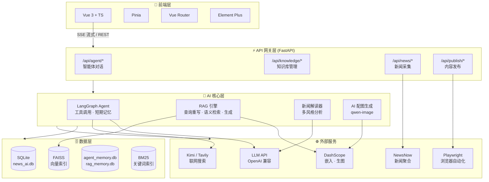
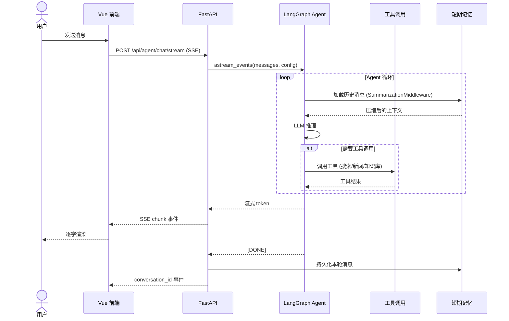
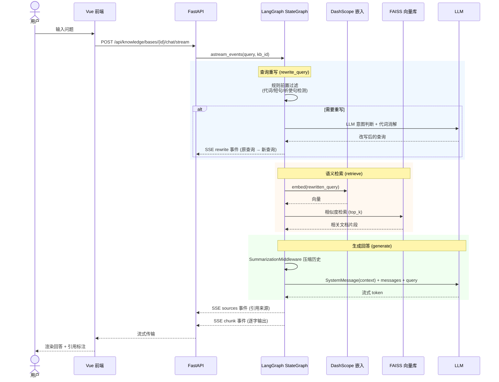
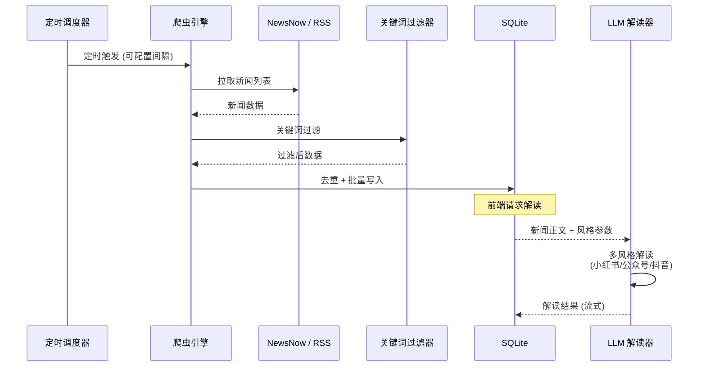
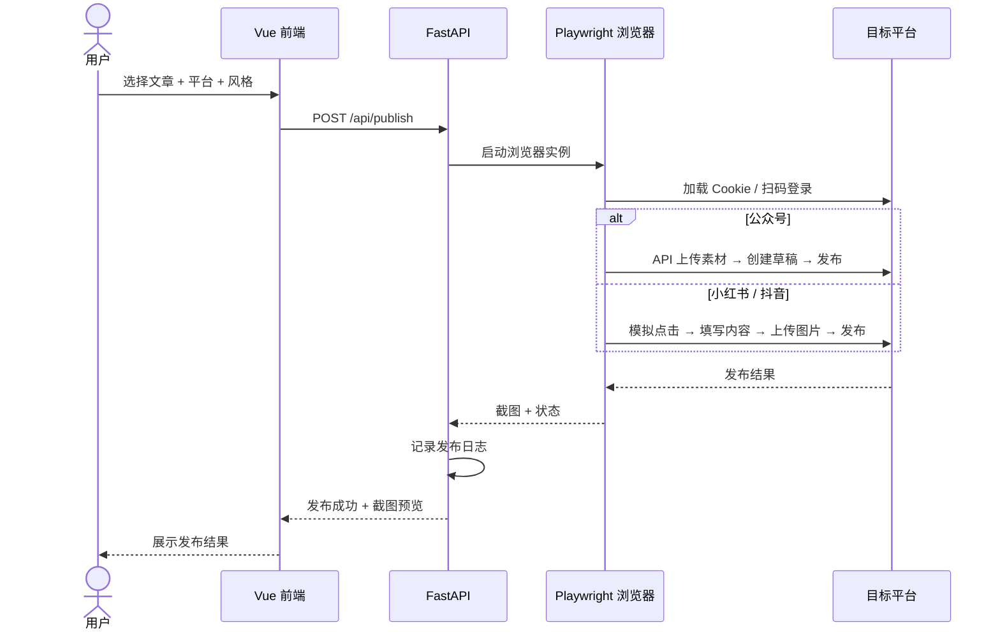

# 识渊 AI · 智能内容工作台

> 基于大语言模型的智能内容创作平台，覆盖「信息获取 → 解读分析 → 知识管理 → 内容生成 → 多平台发布」全链路。

## 功能演示

<video controls width="100%">
  <source src="docs/20260715_184352.mp4" type="video/mp4">
  你的浏览器不支持视频播放。
</video>

---

## 系统架构



---

## 核心流程

### 智能体对话



### RAG 知识库检索



### 新闻采集与解读



### 多平台发布



---

## 技术栈

| 分类 | 技术 |
|------|------|
| **后端框架** | FastAPI (Python) |
| **前端框架** | Vue 3 + TypeScript + Vite |
| **UI 组件库** | Element Plus |
| **状态管理** | Pinia |
| **AI 框架** | LangChain + LangGraph |
| **向量检索** | FAISS + BM25 |
| **嵌入模型** | DashScope text-embedding |
| **数据库** | SQLite (aiosqlite) |
| **浏览器自动化** | Playwright |
| **联网搜索** | Kimi / Tavily 双引擎 |

---

## 核心功能

| 模块 | 能力 |
|------|------|
| **智能体** | 9 工具函数调用 · 短期记忆 (SummarizationMiddleware) · 联网搜索开关 · 多会话管理 |
| **知识库** | 多库隔离 · PDF/DOCX/TXT/MD 解析 · RAG 语义检索 · 查询重写 · 来源引用 |
| **新闻** | 10+ 平台聚合 · 定时爬取 · 关键词过滤 · AI 多风格解读 · 热门追踪 |
| **文章生成** | 小红书/公众号/抖音三风格 · 知识库素材驱动 · AI 配图 (qwen-image) |
| **发布** | Playwright 自动化 · 小红书 · 公众号 · 抖音 · 发布记录追踪 |
| **定时任务** | 自动爬取 · 异步任务面板 · 后台状态追踪 |

---

## 快速开始

### 环境要求

- **Python** >= 3.10
- **Node.js** >= 18
- **Docker** >= 20.10 + Docker Compose v2（推荐，一键部署全部服务）

### 1. 配置环境变量

```bash
cp server/.env.example server/.env
```

编辑 `.env`，填入必要的 API Key：

| 变量 | 说明 |
|------|------|
| `LLM_API_KEY` | 大模型 API Key（必填） |
| `LLM_BASE_URL` | API 地址，默认 OpenAI |
| `LLM_MODEL` | 模型名，如 `gpt-3.5-turbo` |
| `DASHSCOPE_API_KEY` | 阿里云 DashScope（嵌入 + 生图） |
| `MOONSHOT_API_KEY` | Kimi 联网搜索（可选） |
| `TAVILY_API_KEY` | Tavily 联网搜索（可选） |

### 2. Docker 部署（推荐）

一条命令启动全部服务（后端 + 前端 + NewsNow）：

```bash
docker compose up -d
```

首次启动会自动构建镜像（后端需安装 Playwright Chromium，耗时较长）。

**常用命令：**

```bash
# 查看日志
docker compose logs -f backend

# 停止服务
docker compose down

# 代码变更后重新构建
docker compose build && docker compose up -d
```

**服务架构：**

| 容器 | 说明 | 端口 |
|------|------|------|
| `shiyuan-web` | Nginx 静态文件 + API 反代 + SSE 支持 | 8088 → 80 |
| `shiyuan-backend` | FastAPI + Playwright Chromium | 8000 |
| `newsnow-local` | 新闻聚合服务（Docker 网络内部访问） | 4444 |

数据通过命名卷 `shiyuan_data` 持久化（数据库、上传文件、Cookies），`docker compose down` 不会丢失数据。

> 如仅单独启动 NewsNow 新闻源（本地开发用），可执行 `docker compose -f docker-compose.newsnow.yml up -d`，后端会自动 fallback 到公共实例。

### 3. 本地开发启动

**Windows：**
```powershell
.\start.bat
```

**Linux/Mac：**
```bash
chmod +x start.sh && ./start.sh
```

或手动启动：

**后端：**
```bash
cd server
python -m venv venv
source venv/bin/activate  # Windows: .\venv\Scripts\activate
pip install -r requirements.txt
playwright install chromium
python app.py
```

**前端：**
```bash
cd web
npm install
npm run dev
```

### 访问地址

| 服务 | Docker 部署 | 本地开发 |
|------|-------------|----------|
| 前端页面 | `http://localhost:8088` | `http://localhost:8088` |
| 后端 API | `http://localhost:8000` | `http://localhost:8000` |
| API 文档 | `http://localhost:8000/docs` | `http://localhost:8000/docs` |

---

## 许可证

MIT License
